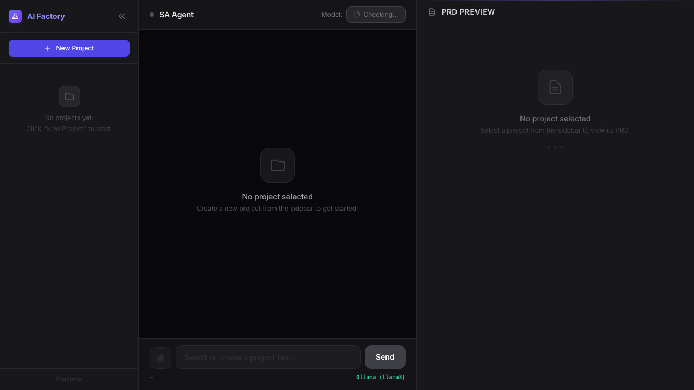

# AI Requirements Factory

A self-hosted AI requirements pipeline for engineering teams.

Status: alpha. The core workflow is usable, but extension points and revision governance are still evolving.

This project turns rough product ideas and source documents into a structured delivery flow:

1. Requirement discovery through a system-analyst interview
2. PRD generation with explicit non-functional requirements
3. Architecture draft generation with Mermaid diagrams
4. User story generation grouped by epic
5. Optional delivery publishing to Jira or GitHub

It is designed for teams that want local control, model flexibility, and a workflow they can customize instead of a closed SaaS product.



## Why this exists

Most AI product-writing tools stop at "generate a PRD". This project is narrower and more operational:

- Self-hosted by default
- Works with local Ollama or CLI-based model backends
- Enforces requirement clarification before final PRD output
- Carries output forward into architecture and delivery artifacts
- Accepts source files such as PDF, DOCX, XLSX, and Markdown

## Who this is for

- Engineering managers
- Internal tooling teams
- Solution architects
- Product and engineering teams that already use Jira or GitHub

## Non-goals

- A full multi-user product management suite
- A hosted collaboration platform
- A generic agent framework

## Current maturity

This repository is suitable for self-hosted evaluation, internal tooling experiments, and contributor feedback.

What to expect in the current alpha:

- The core workflow is working end to end.
- Jira and GitHub delivery publishing are implemented.
- Prompt profiles and model adapters are customizable.
- Project metadata is persisted in the backend, so project lists are shared across devices that connect to the same host.
- Stage edits and AI revisions go through review-first diffs before apply.
- Each stage now has structured review notes, revision metadata, and dependency-aware summary signals.

## Workflow

### Stage 1: Discover

The SA agent interviews the user and asks follow-up questions until requirements are clear. If multiple details are missing, it emits a structured questionnaire instead of an unformatted prompt dump.

### Stage 2: Specify

Once requirements are complete, the backend generates a PRD and marks it ready for the next stage.

### Stage 3: Design

The architecture step produces a technical design draft and Mermaid diagrams. The draft can be manually edited before moving on.

### Stage 4: Deliver

The user stories step generates epic-grouped stories with acceptance criteria and story points. These can then be previewed and published to Jira or GitHub.

## Architecture overview

```text
Browser (Next.js)
  -> FastAPI backend
     -> LangGraph state + SQLite checkpoints
     -> Model adapters (Ollama / Gemini CLI / Claude CLI / Codex CLI)
     -> File ingestion (PDF / DOCX / XLSX / Markdown)
     -> Jira REST API / GitHub REST API
```

## Repository layout

```text
.
├── backend/
│   ├── integrations/
│   ├── prompt_profiles/
│   ├── main.py
│   ├── requirements.txt
│   └── .env.example
├── frontend/
│   ├── app/
│   │   ├── settings/
│   │   └── lib/
│   ├── package.json
│   └── .env.example
├── docs/
│   ├── images/
│   └── project/        # maintainer notes and internal tracking docs
├── ROADMAP.md
└── README.md
```

## Quick start

### Prerequisites

- Python 3.11+
- Node.js 18+
- Ollama if you want to run a local model

### One-command start

```bash
./start.sh
```

This installs dependencies, starts the backend and frontend, and opens the app. Logs go to `backend.log` and `frontend.log`. To stop both services:

```bash
./stop.sh
```

### Manual setup

If you prefer to run each service separately:

**Backend**

```bash
cd backend
python3 -m venv .venv
source .venv/bin/activate
pip install -r requirements.txt
export $(grep -v '^#' .env.example | xargs)
uvicorn main:app --host 0.0.0.0 --port 8000 --reload
```

**Frontend**

```bash
cd frontend
npm install
cp .env.example .env.local
npm run dev
```

Open [http://localhost:3000](http://localhost:3000).

### LAN / multi-device access

If you want to open the UI from another device on the same network, use the default frontend proxy setup instead of pointing the browser to `http://localhost:8000`.

Recommended frontend config:

```env
NEXT_PUBLIC_API_BASE=/api
BACKEND_INTERNAL_BASE=http://127.0.0.1:8000
```

Why this works:

- the browser talks to the same host that served the frontend
- Next.js rewrites `/api/*` to the local FastAPI backend on the host machine
- remote devices do not accidentally resolve `localhost` to themselves

This also fixes a common symptom where model selection appears broken on another device. In that case the frontend is usually trying to call `http://localhost:8000` from the remote browser, which points to the remote device itself instead of the machine running the backend.

If you intentionally want the browser to call the backend directly, set `NEXT_PUBLIC_API_BASE` to a full URL such as `http://192.168.1.50:8000` and update backend CORS accordingly.

Important:

- After changing `NEXT_PUBLIC_API_BASE` or `BACKEND_INTERNAL_BASE`, restart the frontend.
- If the model selector suddenly shows only a fallback state or reports backend-unreachable when you open the app via `http://<host-ip>:3000`, the frontend is usually still using an old direct backend URL or the browser is being blocked by CORS.

## Configuration

### Backend environment variables

See `backend/.env.example`.

- `OLLAMA_HOST`: Ollama base URL
- `OLLAMA_MODEL`: default Ollama model name
- `CORS_ALLOW_ORIGINS`: comma-separated list of allowed origins
- `PROMPT_PROFILE`: prompt profile name under `backend/prompt_profiles/`
- `PROMPT_PROFILE_DIR`: optional absolute path to a custom prompt directory
- `OPENAI_COMPAT_BASE_URL`: base URL for OpenAI-compatible API providers
- `OPENAI_COMPAT_API_KEY`: API key for the OpenAI-compatible provider
- `OPENAI_COMPAT_MODEL`: model name for the OpenAI-compatible provider

### Frontend environment variables

See `frontend/.env.example`.

- `NEXT_PUBLIC_API_BASE`: public API base used by the browser. Recommended default is `/api` so Next.js can proxy requests.
- `BACKEND_INTERNAL_BASE`: backend origin used by the Next.js server-side proxy. Typically `http://127.0.0.1:8000`.
- `NEXT_PUBLIC_DEFAULT_JIRA_DOMAIN`: optional default Jira domain for your team

## Supported inputs

- `.pdf`
- `.docx`
- `.xlsx`
- `.xls`
- `.md`

## Supported model backends

- Ollama
- Gemini CLI
- Claude CLI
- Codex CLI
- OpenAI-compatible APIs

## Context budget management

The backend is model-aware and does not blindly send the full conversation or every artifact on each request.

Current behavior:

- model adapters declare prompt and response token budgets
- long chat histories are compacted with recent-turn preservation
- large markdown artifacts are reduced section-by-section instead of naively truncating raw text
- refinement flows bias retained sections toward the user's latest instruction

This keeps the workflow usable across smaller local models and larger hosted models without requiring the same prompt size everywhere.

## Extending model backends

Model providers are registered through [backend/model_adapters.py](backend/model_adapters.py).  
The adapter contract is documented in [docs/model-adapters.md](docs/model-adapters.md).

## Customizing prompts

Prompt templates are file-based and live under `backend/prompt_profiles/`.

The default profile is:

```text
backend/prompt_profiles/default/
├── sa_system.md
├── sa_amendment_prefix.md
├── sa_chat.md
├── architect.md
├── prd_refine.md
├── architecture_refine.md
├── arch_chat.md
├── user_stories.md
├── user_stories_refine.md
├── stories_chat.md
└── delivery_items.md
```

To customize prompts:

1. Copy `backend/prompt_profiles/default` to a new folder such as `backend/prompt_profiles/enterprise`.
2. Edit the Markdown files in that profile.
3. Set `PROMPT_PROFILE=enterprise` before starting the backend.

If you want prompts outside the repo, set `PROMPT_PROFILE_DIR` to a directory containing the same files.

## Public API

### Projects and chat

- `GET /api/projects` — list all projects
- `POST /api/projects` — create a project
- `DELETE /api/projects/{thread_id}` — delete a project
- `POST /api/chat` — send a message during discovery
- `GET /api/chat/{thread_id}` — retrieve chat history
- `DELETE /api/chat/{thread_id}` — clear chat history

### Generation and refinement

- `POST /api/refine_prd` — refine the PRD with instructions
- `PUT /api/prd/{thread_id}` — save manual PRD edits
- `POST /api/reset_prd/{thread_id}` — reset PRD to last generated version
- `POST /api/generate_architecture` — generate architecture draft
- `POST /api/refine_architecture` — refine architecture with instructions
- `PUT /api/architecture/{thread_id}` — save manual architecture edits
- `POST /api/generate_user_stories` — generate user stories
- `POST /api/refine_user_stories` — refine user stories with instructions
- `PUT /api/user_stories/{thread_id}` — save manual user story edits

### Stage workflow

- `POST /api/stage/{stage}/chat` — stage-scoped chat
- `GET /api/stage/{stage}/chat/{thread_id}` — stage chat history
- `POST /api/stage/{stage}/comments/{thread_id}` — add a review comment
- `GET /api/stage/{stage}/comments/{thread_id}` — list review comments
- `PATCH /api/stage/comment/{comment_id}` — update a comment
- `GET /api/stage/{stage}/events/{thread_id}` — stage activity events
- `GET /api/stage/{stage}/revisions/{thread_id}` — stage revision history
- `PATCH /api/stage/{stage}/status/{thread_id}` — update stage status
- `GET /api/stage/statuses/{thread_id}` — all stage statuses
- `GET /api/stage/summaries/{thread_id}` — dependency-aware stage summaries

### Delivery and integrations

- `POST /api/delivery/preview` — preview delivery items before publish
- `POST /api/delivery/publish` — publish to Jira or GitHub
- `GET /api/jira/projects` — list Jira projects
- `GET /api/github/repos` — list GitHub repositories

### Utilities

- `POST /api/upload` — upload source files
- `GET /api/export/{thread_id}` — export project (`format=markdown` or `format=json`)
- `GET /api/models/check` — check available models
- `GET /health` — backend health check

The export and integration contract is documented in [docs/exports-and-integrations.md](docs/exports-and-integrations.md).

## Shared vs local data

- Project names and project lists are stored in the backend and are shared across devices connected to the same host.
- Stage content, PRD state, architecture, and user stories are also stored in the backend.
- The currently selected project is stored per browser so each device can keep its own active workspace.

## Contributing

See `CONTRIBUTING.md`.

## Security

See `SECURITY.md`.

## Roadmap

See `ROADMAP.md`.

## Additional docs

- [Architecture Guide](docs/architecture.md)
- [Context Budget Management](docs/context-budget.md)
- [Export and Integration Contract](docs/exports-and-integrations.md)
- [Model Adapter Contract](docs/model-adapters.md)
- [Hosted Boundary](docs/hosted-boundary.md)
- [Examples](examples/README.md)

## License

This project is licensed under Apache-2.0. See `LICENSE`.
