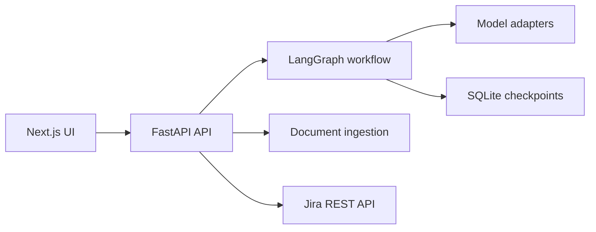
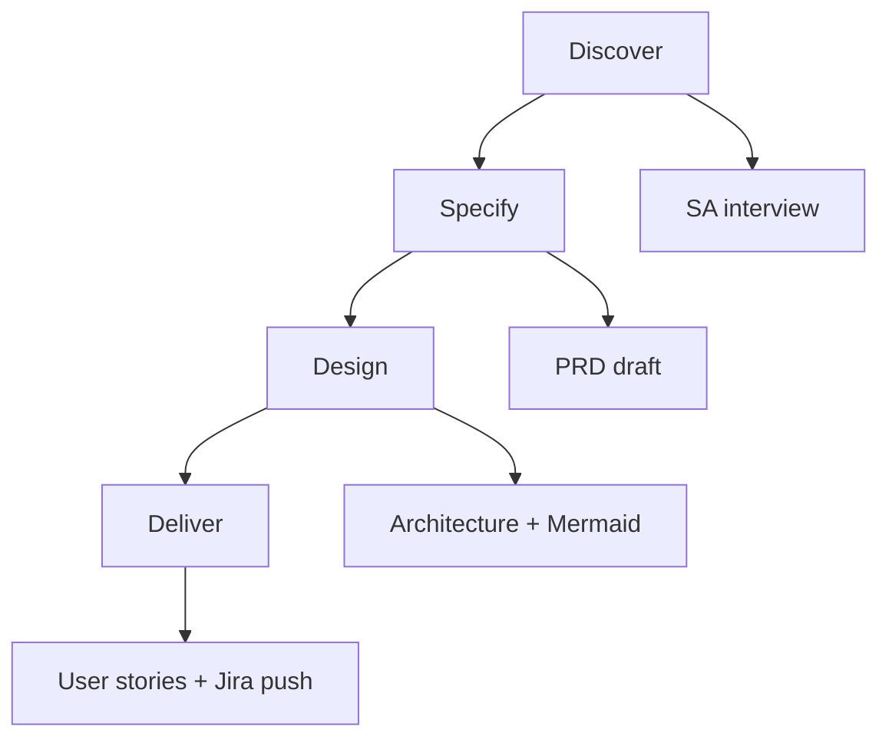
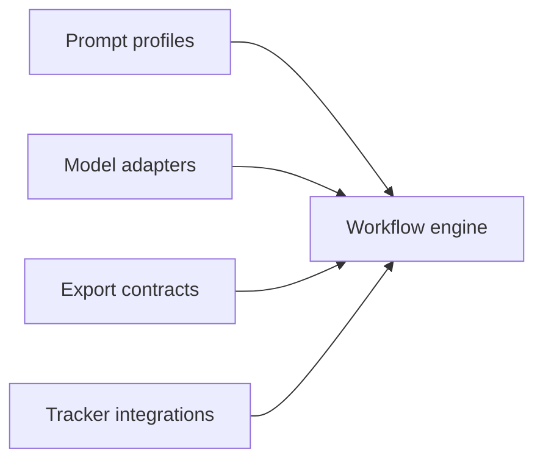

# Architecture Guide

## Runtime components

```mermaid
flowchart LR
    UI["Next.js UI"] --> API["FastAPI API"]
    API --> GRAPH["LangGraph workflow"]
    GRAPH --> MODELS["Model adapters"]
    GRAPH --> STORE["SQLite checkpoints"]
    API --> FILES["Document ingestion"]
    API --> JIRA["Jira REST API"]
```

## Workflow stages

```mermaid
flowchart TD
    A["Discover"] --> B["Specify"]
    B --> C["Design"]
    C --> D["Deliver"]

    A --> A1["SA interview"]
    B --> B1["PRD draft"]
    C --> C1["Architecture + Mermaid"]
    D --> D1["User stories + Jira push"]
```

## Extensibility map

```mermaid
flowchart LR
    P["Prompt profiles"] --> GRAPH["Workflow engine"]
    M["Model adapters"] --> GRAPH
    E["Export contracts"] --> GRAPH
    I["Tracker integrations"] --> GRAPH
```

## UI snapshot

