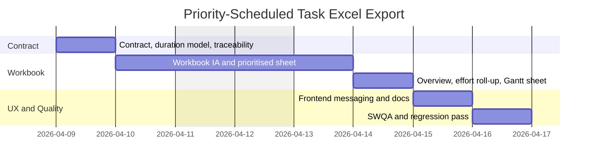

# Implementation Plan: Priority-Scheduled Task Excel Export

## Document Control

- Title: Priority-Scheduled Task Excel Export
- Status: planned
- Owner: Sheldon / maintainer
- Last Updated: 2026-04-08
- Spec: `docs/specs/priority-scheduled-task-excel-export.md`
- Related Issue / PR:

## Objective

Implement an Excel-based file export path for delivery-ready tasks by reusing the existing delivery item model, upgrading workbook quality, replacing Story-Point-led planning with senior-RD duration estimates, adding Requirement ID traceability, and generating a Gantt-style schedule view that can be reviewed outside Jira or GitHub.

## Traceability

| Spec Item | Type | Covered By Slice | Covered By Task | Verified By |
| --- | --- | --- | --- | --- |
| `FR-1` | functional | Slice 3 | Task 6 | `AC-1` |
| `FR-2` | functional | Slice 2 | Task 4 | `AC-2`, `AC-3` |
| `FR-3` | functional | Slice 1, Slice 2 | Task 2, Task 5 | `AC-2` |
| `FR-4` | functional | Slice 1, Slice 2 | Task 1, Task 4 | `AC-3` |
| `FR-5` | functional | Slice 1, Slice 2 | Task 2, Task 5 | `AC-2`, `AC-3` |
| `FR-6` | functional | Slice 1, Slice 3 | Task 2, Task 6 | `AC-1`, `AC-4` |
| `FR-7` | functional | Slice 2 | Task 5 | `AC-2` |
| `FR-8` | functional | Slice 1, Slice 2, Slice 3 | Task 1, Task 4, Task 7 | `AC-3` |
| `NFR-1` | non-functional | Slice 2, Slice 3 | Task 5, Task 8 | `AC-2` |
| `NFR-2` | non-functional | Slice 2 | Task 3, Task 4, Task 5 | `AC-2` |
| `NFR-3` | non-functional | Slice 2, Slice 3 | Task 5, Task 6 | `AC-1` |
| `NFR-4` | non-functional | Slice 1 | Task 1, Task 2 | `AC-4` |
| `OPS-1` | operational | Slice 1, Slice 3 | Task 2, Task 8 | `AC-4` |
| `OPS-2` | operational | Slice 1, Slice 2, Slice 3 | Task 1, Task 5, Task 7 | `AC-3` |
| `OPS-3` | operational | Slice 3 | Task 6, Task 8 | `AC-4` |
| `OPS-4` | operational | Slice 3 | Task 7, Task 8 | `AC-2`, `AC-3` |

If a spec item cannot be mapped, the plan is not ready.

## Out of Scope

- spreadsheet import or round-trip editing
- capacity planning or staffing calculations for multiple engineers
- full new stage creation beyond the existing delivery flow

## Assumptions

- estimates are expressed as ideal engineering days for one senior full-stack RD
- Story Points may remain transitional metadata only where tracker integrations still require them
- Requirement IDs can be attached from source artefacts or marked for review when unmapped
- one maintainer can complete the implementation without parallel worker handoff

## Affected Areas

- Frontend: `frontend/app/page.tsx`, `frontend/app/settings/page.tsx`
- Backend API: delivery export route in `backend/main.py`
- Workflow / persistence: delivery item transformation in `backend/workflow.py` and `backend/artifacts.py`
- Prompt profiles: `backend/prompt_profiles/default/user_stories.md`, `backend/prompt_profiles/default/user_stories_refine.md`
- Integrations / export: `docs/exports-and-integrations.md`, possible Jira/GitHub compatibility handling
- Docs / sample output: `docs/specs/priority-scheduled-task-excel-export.md`, `output/spreadsheet/`

## Execution Strategy

Favour a delivery-target extension rather than a parallel ad hoc export path. Reuse the existing delivery item contract first, then layer duration estimates, workbook formatting, traceability, and frontend download flow on top.

Suggested order for this repo:
1. define the export row contract and planning metric transition
2. build workbook information architecture and visual system
3. add Requirement ID traceability and Gantt scheduling
4. wire frontend messaging and keep tracker publishing stable
5. complete SWQA-oriented verification and docs

## Work Slices

### Slice 1

- Goal: define a stable planning-row contract with senior-RD duration and Requirement ID traceability
- Spec refs: `FR-3`, `FR-4`, `FR-5`, `FR-6`, `FR-8`, `NFR-4`, `OPS-1`, `OPS-2`
- Story refs: `US-1`, `US-3`, `US-4`
- Acceptance refs: `AC-1`, `AC-3`, `AC-4`
- Files likely touched: `backend/workflow.py`, `backend/artifacts.py`, prompt profiles, `backend/main.py`
- Deliverable: deterministic export row model and error-handling contract
- Dependencies: existing delivery item parsing
- Verification: fixture checks and API error-path checks

### Slice 2

- Goal: generate a polished workbook with prioritised planning, overview metrics, and Gantt scheduling
- Spec refs: `FR-2`, `FR-3`, `FR-4`, `FR-5`, `FR-7`, `FR-8`, `NFR-1`, `NFR-2`, `NFR-3`, `OPS-2`
- Story refs: `US-1`, `US-2`, `US-3`, `US-4`
- Acceptance refs: `AC-2`, `AC-3`
- Files likely touched: `backend/exports_excel.py`, `backend/main.py`, sample workbook
- Deliverable: downloadable `.xlsx` workbook with overview, prioritised tasks, Gantt schedule, and guidance sheets
- Dependencies: Slice 1 contract
- Verification: workbook inspection in Excel or Sheets

### Slice 3

- Goal: expose the export cleanly in the delivery UX and complete SWQA-ready verification
- Spec refs: `FR-1`, `FR-6`, `FR-8`, `OPS-3`, `OPS-4`
- Story refs: `US-1`, `US-2`, `US-4`
- Acceptance refs: `AC-1`, `AC-4`
- Files likely touched: `frontend/app/page.tsx`, `frontend/app/settings/page.tsx`, `docs/exports-and-integrations.md`, spec / plan docs
- Deliverable: enabled export option, stable UX copy, and documented verification ownership
- Dependencies: Slice 1 and Slice 2
- Verification: manual delivery flow exercise and SWQA checklist run

## Tasks

| Task | Slice | Purpose | Requirement refs | Primary owner | Senior RD effort | Output | Verification |
| --- | --- | --- | --- | --- | --- | --- | --- |
| Task 1 | Slice 1 | extend the delivery-item/export-row contract with `senior_rd_days` and `requirement_refs` | `FR-4`, `FR-8`, `NFR-4`, `OPS-2`, `AC-3` | Backend | 0.5d | transformation helper + contract update | fixture-based ordering and traceability check |
| Task 2 | Slice 1 | update prompt/parse flow so workbook planning uses senior-RD duration and preserves structured failures | `FR-3`, `FR-5`, `FR-6`, `NFR-4`, `OPS-1`, `AC-1`, `AC-4` | Backend + Prompt | 0.5d | prompt/profile and parser changes | API check + fallback parsing check |
| Task 3 | Slice 2 | define workbook information architecture and visual system before styling implementation | `FR-3`, `NFR-2`, `AC-2` | Backend | 0.5d | sheet schema, style tokens, sample layout | workbook review against spec |
| Task 4 | Slice 2 | build the prioritised task sheet with richer styling, traceability columns, and filterable structure | `FR-2`, `FR-4`, `FR-8`, `NFR-2`, `OPS-2`, `AC-2`, `AC-3` | Backend | 1.0d | main worksheet | open workbook and inspect |
| Task 5 | Slice 2 | add overview metrics, effort roll-ups, and a Gantt-style schedule sheet | `FR-3`, `FR-5`, `FR-7`, `NFR-1`, `NFR-2`, `NFR-3`, `OPS-2`, `AC-2`, `AC-3` | Backend | 1.5d | overview and Gantt sheets | open workbook in Excel / Sheets |
| Task 6 | Slice 3 | adjust frontend CTA, messaging, and download flow for file-export semantics | `FR-1`, `FR-6`, `OPS-3`, `AC-1` | Frontend | 0.5d | UI/UX update | manual delivery-flow exercise |
| Task 7 | Slice 3 | document export contract, Requirement ID rules, and SWQA verification ownership | `FR-8`, `OPS-2`, `OPS-4`, `AC-3` | Docs | 0.5d | docs update | docs review |
| Task 8 | Slice 3 | execute workbook compatibility, regression, and SWQA checklist validation | `NFR-1`, `OPS-1`, `OPS-3`, `OPS-4`, `AC-2`, `AC-4` | SWQA + Engineering | 0.5d | validation evidence and sample workbook | manual + build verification |

## Senior RD Duration Estimate

Assumptions for this estimate:
- one senior RD is already familiar with this repo and can work mostly without interruption
- effort is counted in ideal engineering days, not calendar days
- feedback cycles from PM or additional design review are not included in the base estimate

Estimated implementation effort:

| Slice | Scope | Senior RD effort |
| --- | --- | --- |
| Slice 1 | planning metric transition, Requirement ID contract, parser/error handling | `1.0d` |
| Slice 2 | workbook redesign, prioritised sheet, overview, Gantt schedule | `3.0d` |
| Slice 3 | frontend messaging, docs, SWQA/regression validation | `1.5d` |
| Total | end-to-end implementation | `5.5d` |

Practical interpretation:
- ideal engineering effort: about `5.5` working days
- likely calendar duration with review / fix loops: about `6` to `8` working days

## Gantt Schedule

The chart below assumes work starts on 2026-04-09 and one senior RD is the primary implementer. Each bar maps to the task groups above; Requirement ID links live in the `Tasks` table.

## Verification Matrix

| Area | Check | Owner | Command / Method |
| --- | --- | --- | --- |
| Backend syntax | Python modules compile | `Engineering` | `python3 -m py_compile backend/main.py backend/artifacts.py backend/workflow.py backend/model_adapters.py backend/context_budget.py backend/integrations/jira.py backend/integrations/github.py backend/integrations/registry.py backend/integrations/registry_map.py backend/exports_excel.py` |
| Frontend build | Next.js build passes | `Engineering` | `cd frontend && npm run build` |
| Workbook layout | overview, prioritised task sheet, Gantt view, formulas, widths, and styles render correctly | `SWQA` | manual workbook review in Excel and Google Sheets |
| Traceability | Requirement IDs are present and match the source sample | `SWQA`, `PM` | sample-based workbook inspection |
| Planning logic | duration totals and schedule ordering match the documented rules | `Engineering`, `SWQA` | fixture check + workbook inspection |
| Regression surface | Jira and GitHub publish still behave as before | `Engineering`, `SWQA` | manual delivery flow check |

## Sequencing Notes

- start with the export row contract before styling work
- treat Story Points as transitional compatibility metadata only while downstream integrations still depend on them
- keep workbook generation isolated in a helper so UI changes stay thin
- use the task table, not the Gantt chart, as the source of truth for Requirement ID traceability

## Risks and Mitigations

- Risk: visual polish expands indefinitely
  Mitigation: lock sheet structure and acceptance checks before spending time on visual refinements
- Risk: duration estimates drift from reality
  Mitigation: keep the estimate model explicit and label it as senior-RD ideal effort
- Risk: requirement traceability is incomplete in source stories
  Mitigation: surface unmapped rows clearly and make them part of SWQA review
- Risk: Jira/GitHub delivery paths regress during the planning-metric transition
  Mitigation: keep tracker compatibility checks in the regression pass

## Done Criteria

- The acceptance criteria in the linked spec are met.
- Every implementation task maps to a requirement ID or acceptance criterion.
- The workbook visibly includes senior-RD effort, Requirement IDs, and a Gantt-style schedule.
- Validation commands pass.
- Manual checks for the affected delivery flow and workbook rendering have been completed.
- SWQA ownership and verification evidence are documented.

## Deferred Work

- capacity-aware team planning beyond one senior RD
- milestone or sprint view variants beyond the first Gantt sheet
- end-to-end removal of legacy Story Points once tracker integrations are intentionally migrated
